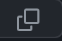

# cse110-fq21-group40

## Application description
We are aiming to create an audio note taking app geared towards musicians, where users can take notes on audio files with HTML, CSS and JavaScript.  

## Table of Contents
- [cse110-fq21-group40](#cse110-fq21-group40)
  - [Application description](#application-description)
  - [Table of Contents](#table-of-contents)
  - [Social Links](#social-links)
  - [Getting Started](#getting-started)
    - [Requirements](#requirements)
    - [Installing our software](#installing-our-software)
    - [Running our software](#running-our-software)
  - [Running Our Tests](#running-our-tests)
    - [What is **Jest**?](#what-is-jest)
    - [Creating your own tests](#creating-your-own-tests)
  - [Example Use case](#example-use-case)
    - [User personas](#user-personas)
    - [User stories](#user-stories)
  - [Youtube Tutorial](#youtube-tutorial)
  - [Documentation](#documentation)
  - [Future Plans](#future-plans)
    - [Near Future](#near-future)
    - [Far Future](#far-future)
  

## Social Links
Our wonderful **[staff](admin/team.md)**

A look at our **Miro [plans](https://miro.com/app/board/uXjVPJ88Awg=/?share_link_id=881331704226)** 

See our **Figma [prototype](https://www.figma.com/file/kYV50OgVgPx6Iw9bspYB9W/LitHub-Wireframes?node-id=0%3A1)**

Take a peek at our notes on **[Notion](https://www.notion.so/The-Lit-Hub-24ded023c9f3498b91e11f9db74a3996)**

## Getting Started

### Requirements
You should have NodeJS installed (If you get stuck check out this [page](https://nodejs.dev/en/learn/how-to-install-nodejs)).
### Installing our software
1. Navigate to our main repository page and look for the green button above the files labeled **< >Code**.
2. After clicking the button, copy the link to the repository pressing this button 
3. Open your favorite code editor and in their terminal run the command ***git clone*** along with what you copied (You may need to specify where you want this on your file system).
4. Once again in the terminal run the command ***npm install*** to get all dependancies 
    

### Running our software
1. Assuming all the tasks from the section above **Installing our software** was done correctly you may move on to the next step.
2. In your terminal run the command ***npm run start*** to get started!
    
## Running Our Tests
### What is **Jest**?
### Creating your own tests

## Example Use case
### User personas
### User stories

## Youtube Tutorial
Link to youtube [video](https://www.youtube.com/watch?v=dMgJ_TWeIxc&feature=youtu.be)
## Documentation
[Check out how to use our functions](https://cse110-fq22-group40.github.io/cse110-fq22-group40/index.html)

## Future Plans
### Near Future
### Far Future
