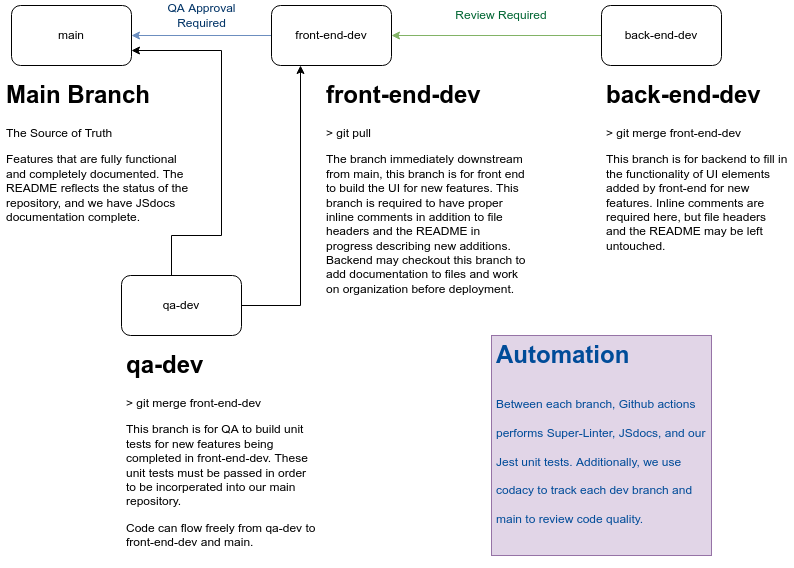

# Phase 1 Pipeline

# Automation:

## Linting:

Time was spent during sprint 1 exploring ESLint and Super-Linter to find stylistic and logical errors in our source code. With this tool, we can maintain code quality and consistent style before we merge into our main branch and potentially introduce errors into our existing codebase. One benefit of using Super-Linter is that it can catch errors before it is merged into our main branch in a simple way that takes minimal fuss to achieve. For this reason, we implemented super-linter and plan to rely on it during our second sprint.

## Code Quality Control:

Here is our current code quality report:

[Codacy - Automated code reviews](https://app.codacy.com/gh/cse110-fq22-group40/cse110-fq22-group40/dashboard)

Both Codacy and CodeClimate have been investigated to track our branches and report on negative code features like unused code, and stylistic errors. These tools provide insights to improve our code quality. We decided to implement Codacy to automatically quality check code when a pull request is initiated and use their quantitative insights to improve our code before merging our code into main and improve the efficiency of our sprints.

# Documentation Generation:

Here is our current documentation that has been generated using JSdocs:

[Home](https://cse110-fq22-group40.github.io/cse110-fq22-group40/)

- Using JsDocs to automatically generate online documentation for our code.
- We believe this would be highly useful for communication and collaboration between our development team
- Everyone can use the documentation as reference and would improve the efficiency of our sprints
- Currently building a workflow for JsDocs to build the static documentation files through GitHub actions and automatically deploy through GitHub pages.
- Still in the development stage of work and will be fully implemented in the second sprint
    - currently we generate using JSdocs locally to avoid using a generated key

# Unit Testing using Jest:

- This is going to be our testing framework so that we can add unit test onto our code
- It is currently in development to be added onto our current pipeline work flow
- We are just currently adding test manually as we await this feature to be implemented
- We have an current example test in our testing folder just to see how it would work
- One reason the main reason we do want to move forward with this framework in the future is because it would allow us to write tests with something that is easy to work with to give us quick useful results
- It also provides snapshot testing and built-in code coverage reports so we can gain better insight on how to improve our code.
- As well as provides the convenience of being able to run tests in parallel and has an assertion library built in.

# Github Workflow:

Our workflow has a total of four branches with rules, both automated and human managed, for moving code between branches. This ensures only high-quality, well documented, and working code is in main.

## Pull Requests

The QA team is planning to review code manually to check logical and stylistic errors before merging code into main and provide feedback to the front-end and back-end development team as necessary.

### Main Branch

- Holds most up to date launch-able product
- Has been well tested
    - Passes automated test
    - Passes human testing
- Is well documented
    - styling is correct
    - there are correct function header and proper inline comments

### Front-end-dev

- Holds the current work that font end is working on, and last merge from the back-end team
- It is down-steam from the main branch
- This is the work space of the front end were they can experiment and work on new features
- In order for this code to end up in main, must go through some of our automated styling and testing checks.
- If it passes those, we would then push it onto the main branch only after one of our QA’s can review the merge. They will check if any further test and documentation is need and if them deem so, they can reject the merge yet otherwise they can allow the merge to go through.

### QA-dev

- Can hold work from main or front-end-dev branches to create further unit testing
- QA may use this branch to test the pipeline itself for GitHub actions and its generated documents
- Is the gate keeper of the main branch, and makes sure we our automated aspects of our pipeline up and running
- Code can freely exit this branch into any other branch with review from a QA dev

### Back-end-dev

- Holds the current work that the back end is working on, and is the lowest branch with the most up to date code regardless of styling and testing.
- Is downstream of front-end-dev, so anything that happens in front-end branch should be merged into the back-end-dev branch before work is started
- This is the work space of the back end team were they as well can experiment and work on new features
- The main this work end up in main is first it needs to be push onto front-end-dev branch with correct documentation and correct testing in place along with passes automated testing and documentation checks.
- Then it would go under be part of front-end-dev and follow the steps for that branch to end up in main