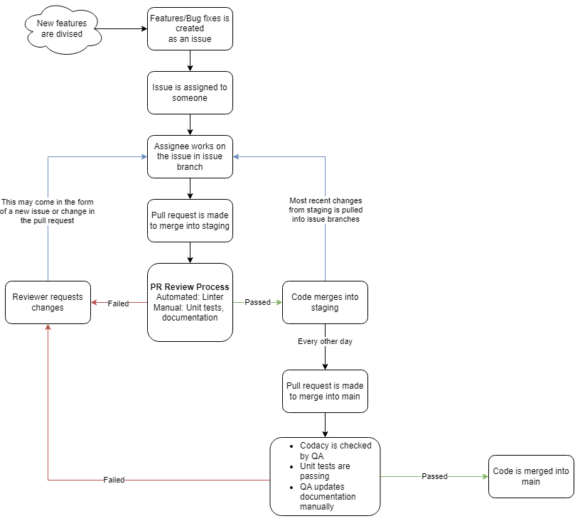
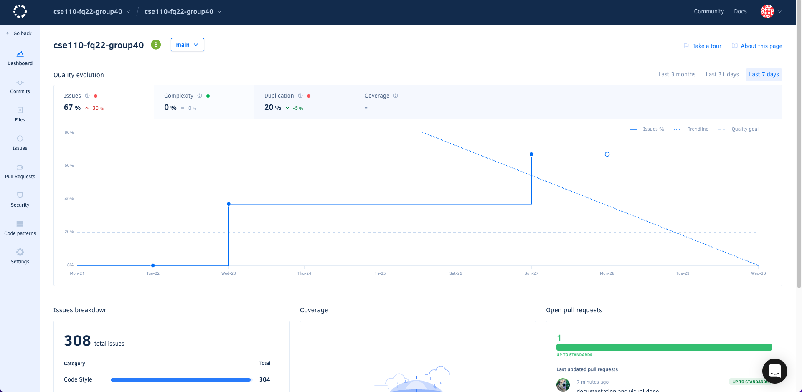
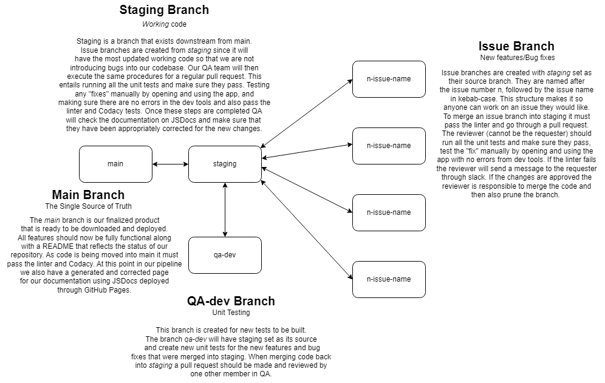

# Phase 2 CI/CD Pipeline

QA Participants: Billy Sudirdja, Ben Snowbarger, Sailor Eichhorn, Katherine Wong

Type: Design and Planning

# Pipeline Diagram:

# Automation:

## Linting:

During Sprint 2, we refined our GitHub actions such that with every new pull-request to our staging and main branch, we run Super-Linter to find stylistic or logical errors in newly added Javascript code (Super-Linter uses ESLint). With this tool, we can maintain style consistency across all our files containing JavaScript, and catch errors before it is merged into our staging and our branch. Due to a late implementation of the Super-Linter, and how we only started requiring it to pass for code to be merged into main and the staging branches during Sprint 2, we currently have a lot of styling issues in our working codebase. For our next sprint, we hope to start validating files containing HTML and CSS, after fixing all the styling on our files containing JavaScript first.

## Code Quality Control:

We currently implement Codacy, an automated code quality tool to review code again for stylistic, logical, security errors. It currently checks the code that is being merged into staging and main branches. It implements linting (specifically ESLint), and an additional feature we find useful for our pipeline are suggestions via conversations in the pull request, where the Codacy Bot checks our code and offers suggestions to increase our code quality report. With these suggestions, we can easily increase the quality of our code before it is merged into our staging and main branches. 

An additional feature we find useful is being able to sort commits, pull requests, specific files, on the Codacy dashboard to see detailed reports of our issues and suggestions to fix it. The last feature we find helpful is being able to see a running log of all the issues that exist in our code, and we can strive to achieve a high quality codebase using Codacy as a tool, which consistently gives us accurate, and detailed reports about our code. 

Currently, our main branch is graded as a B. We hope that after all of our individual team members start fixing up styling in our old code, we can achieve an A on our main branch to ensure that we have high quality code and software that is being released to the public. 

## Documentation Generation:

Here is our current documentation that has been generated using JSDoc. 

[JSDocs Documentation](https://cse110-fq22-group40.github.io/cse110-fq22-group40/)

As code is moved from individual feature branches into staging, and staging into main, our `/.github/workflows/jsdoc.yml` file, defines a workflow that automatically builds JSDoc HTML files that are sourced from specific JavaScript files. These new functions and code properties will  be updated in the new JsDoc `index.html` file. Then, as new code is moved from staging to main, the automatic GitHub `pages-build-deployment` workflow (this is automatically done when you enable GitHub Pages) will run such that every time code is being merged into main, it will automatically deploy the newly built JsDoc documentation page of our working codebase in main. 

When a PR is initiated to either staging or main, a person from QA will have to manually check the JSDocs documentation to make sure all the newly implemented functions and code are included in the new documentation. This JSDocs has been helpful for both the front-end and back-end team in allowing an easy way to look through the code for existing functions, existing Classes and its properties, and where we can find it in our source code. For main specifically, the `index.html` file needs to be successfully deployed before the PR can be merged.

For Sprint 2, we have had a massive refactor in our code. Thus, our JSDoc documentation page is not fully updated with the new filing system. This will be worked on after this Sprint and the QA team will be making sure that our code and functions are organized properly in the documentation. This documentation will be featured in our `[README.md](https://cse110-fq22-group40.github.io/cse110-fq22-group40/index.html)` under our “Documentation” section.

# Unit Testing using Jest:

Unit tests are typically generated by looking through the comments of the function that it is testing. We write unit tests to check to the functionality and to see if the proper errors are being thrown. When we check the functionality, we look at if the function modifies the data correctly. An example of this is checking the constructor for an object. We would use the constructor with specified input and validate that the data is being properly modified. In the case where we want to test errors we would use the function improperly like using the constructor with no input then we expect a certain error to be thrown. We have only been testing the basic functions that are related to the classes we are defining and will do more comprehensive testing with end-to-end testing.

# End-to-End Testing

End-to-end testing is done after unit testing has confirmed the individual functions operate properly. These tests inspect aspects of the code working together to ensure that not only do the functions return what is expected, but also work with one another as expected to produce the forward-facing aspect of our project. An simple example of this in our project would be, on the home screen, creating a new type-F folder, then ensuring that this new folder displays properly and the text on screen is updated to reflect this new object. A full end to end test, however, will test the application from the start to the end by emulating user actions. For this type of testing, we are using the Puppeteer API as well as the [Webdriver.IO](http://Webdriver.IO) framework because of its native support for Electron.

# GitHub Workflow and Branch System

## Branch Protection Rules

For the merging individual issue branches into the staging branch, Codacy and Super-Linter checks are required to pass. Additionally, another reviewer other than yourself is required to approve the PR before it can be merged. Conversations must also be resolved, such that if a reviewer leaves a suggestion, you must resolve and address that concern before the branch can be allowed to merge. If a reviewer contributes to the PR, then you must add an additional reviewer since we require that the latest push must be approved by someone else other than the last pusher. 

For merging staging into main, we have the same protection rules set; however, this needs to be manually approved by someone in the QA team to be merged. 

## GitHub Issues

Issues are created when a developer wants to bring forth a new feature or address a bug in the working codebase. Once code that addresses this issue is moved into the main branch, the issue will be closed. 

## Branches

### Main Branch (Single Source of Truth)

Staging is a branch that exists downstream from main. Issue branches are created from *staging* since it will have the most updated working code so that we are not introducing bugs into our codebase. Our QA team will then execute the same procedures for a regular pull request. This entails running all the unit tests and make sure they pass. Testing any "fixes" manually by opening and using the app, and making sure there are no errors in the dev tools and also pass the linter and Codacy tests. Once these steps are completed QA will check the documentation on JSDocs and make sure that they have been appropriately corrected for the new changes.

### Staging Branch (working code)

Staging is a branch that exists downstream from main. Issue branches are created from *staging* since it will have the most updated working code so that we are not introducing bugs into our codebase. Our QA team will then execute the same procedures for a regular pull request. This entails running all the unit tests and make sure they pass. Testing any "fixes" manually by opening and using the app, and making sure there are no errors in the dev tools and also pass the linter and Codacy tests. Once these steps are completed QA will check the documentation on JSDocs and make sure that they have been appropriately corrected for the new changes.

### QA-dev

This branch is created for new tests to be built. The branch *qa-dev* will have staging set as its source and create new unit tests for the new features and bug fixes that were merged into staging. When merging code back into *staging* a pull request should be made and reviewed by one other member in QA.

### Issue Branch

Issue branches are created with *staging* set as their source branch. They are named after the issue number n, followed by the issue name in kebab-case. This structure makes it so anyone can work on an issue they would like. To merge an issue branch into staging it must pass the linter and go through a pull request. The reviewer (cannot be the requester) should run all the unit tests and make sure they pass, test the "fix" manually by opening and using the app with no errors from dev tools. If the linter fails the reviewer will send a message to the requester through slack. If the changes are approved the reviewer is responsible to merge the code and then also prune the branch.

## Pull Requests

For PRs into staging, another reviewer from the team (does not have to be a QA team member) is expected to test the new code manually by running `npm run test` locally, and testing the application locally to make sure the new feature is being implemented correctly with no issues. 

For PRs into main, the QA team is planning to review code manually to check logical and stylistic errors before merging code into main to provide feedback to developer initiating the pull request as necessary. We will also be running `npm run test` locally, and testing the application locally to make sure the new feature is being implemented correctly with no issues.