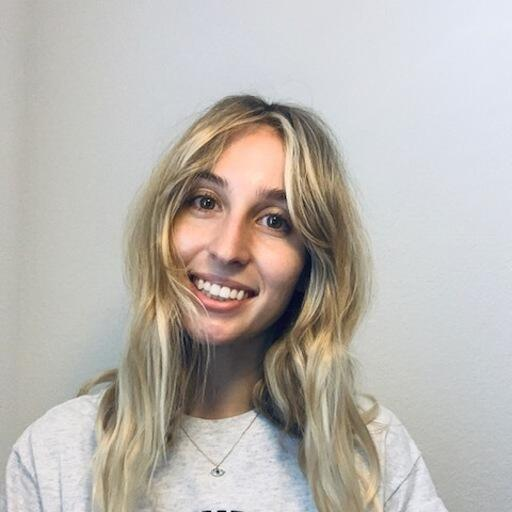
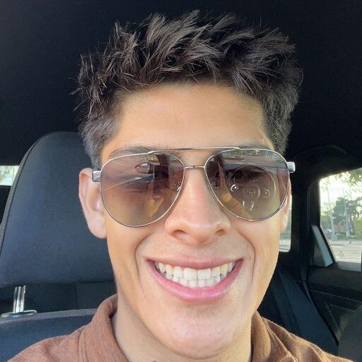
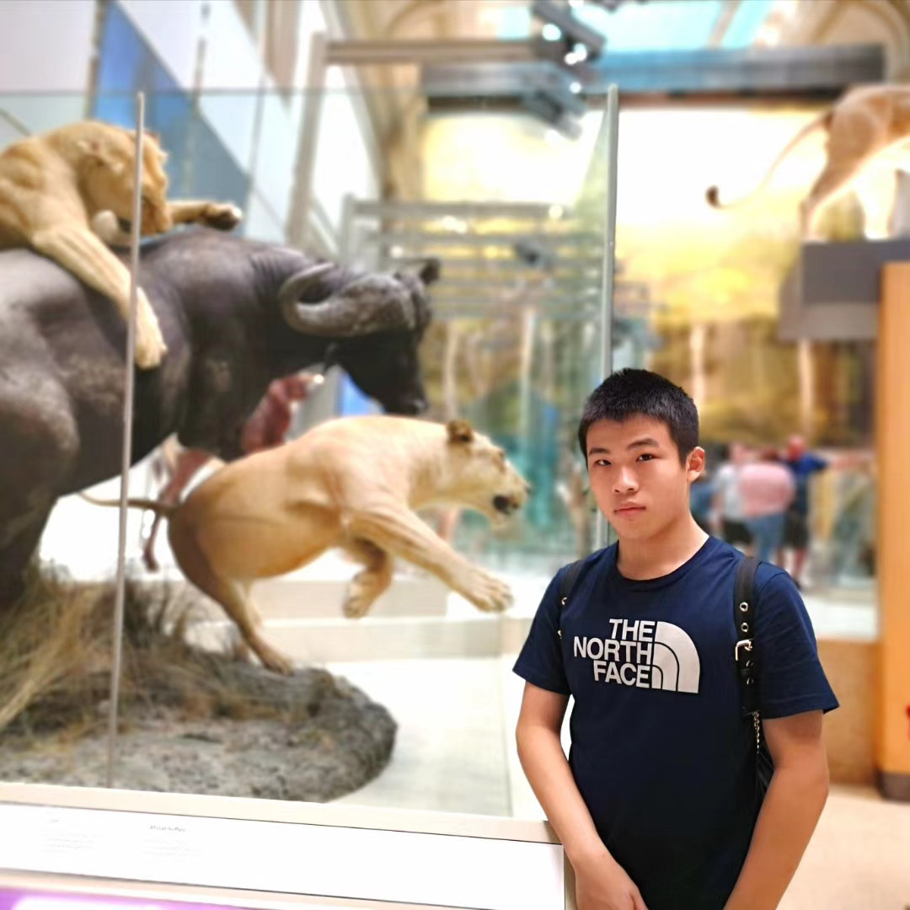
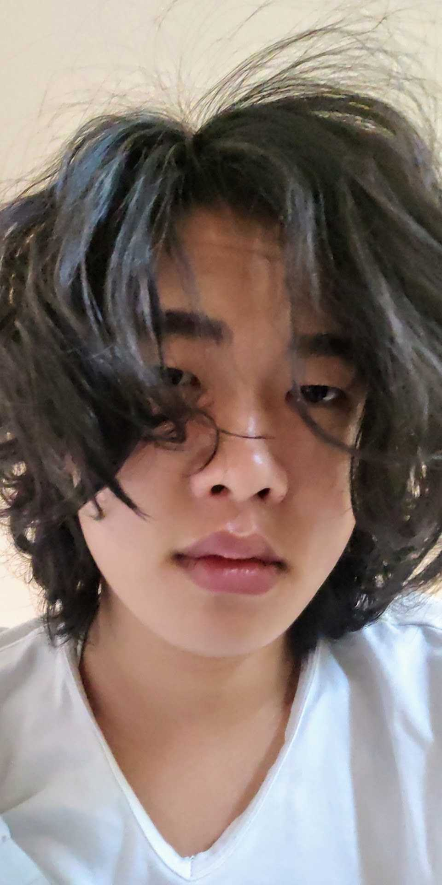
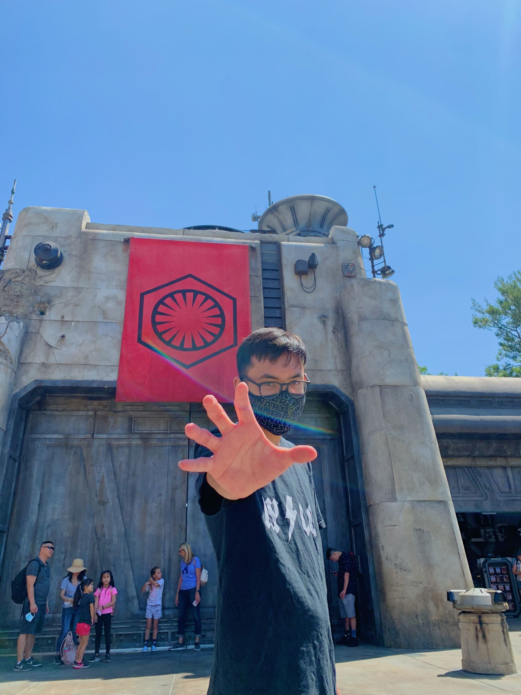
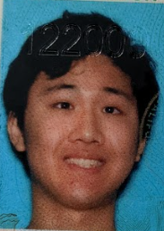

# CSE 110 - Team Lithub

### Table of Contents

> 1. [Project Overview](#project-overview)
> 2. [Our Philosophy](#our-philosophy)
> 3. [Team members](#team-members)

## Project Overview

## Our Philosophy

## Team Members
-  \
[Sailor Eichhorn](https://sailorforschool.github.io/SuperCoolRepo/) 

-  \
 [Emmanuel Serrano](https://emmanuel-serrano.github.io/GitHub_Pages_Project/)

-  \
[Alex Wu](https://alex10wu.github.io/CSE110-Alex-Wu/) 

-  \
[Ben Snowbarger](https://bsnow1400.github.io/Pages-Project/)

-  \
[Bennett Zhang](https://bennett-zhang.github.io/CSE-110-Lab-1/)

-  \
[Billy Sudirdja](https://github.com/billysud/Lab0CSE110/)

-  \
[Ernest Lin](https://ernestl123.github.io/ernestl123/)

-  \
[Grace Jin](https://hongyuejin.github.io/GithubPages/)

-  \
[Kevin Truong](https://wozzack.github.io/pages/)

-  \
[Ryan Truong](https://ryan-truong.github.io/cse110lab/)