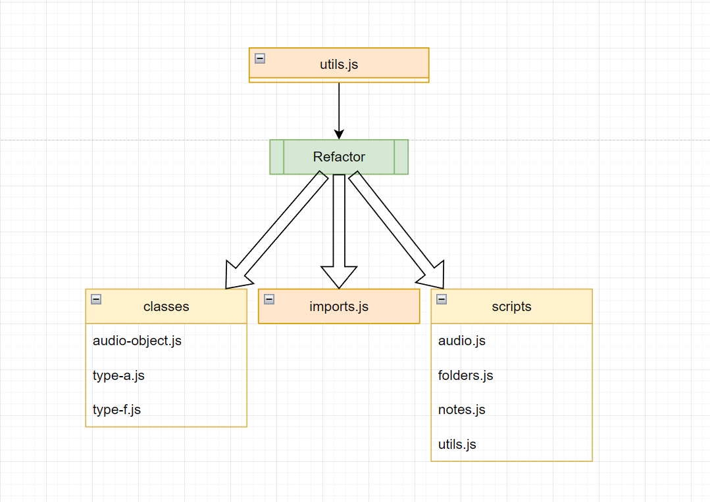

---
    status: {Accepted}
    date: {2022-11-16}
    last update: {2022-11-28}
    deciders: {Sailor Eichhorn, Emmanuel Serrano}
    consulted: {Allison Turner}
    informed: {Rest of Team}
    ---

# Refactoring the Codebase

## Context and Problem Statement

Finding and accessing the needed functions in the utils.js file is a challenge for our team at times. How can we re-organize the file to be more intuitive for us to use and allow for better logical flow when re-reading the code?

The back-end team originally used the "utils.js" file to hold helper functions that were needed throughout the codebase. As can be seen by the unhelpful name of the file, this file served as a messy "catch-all" for a lot of the functions needed for the application to function. This file proved very difficult and cumbersome to navigate for the developers, and we worry as the project expands in size and complexity, it would only continue get worse.

## Decision Drivers

- Intuitive logic for how to access needed functions
- Enables cleaner and easier documentation
- Possible increase in productivity flow 

## Considered Options

- Refactoring
- Continuing to use utils.js as a catch-all file
  
## Decision Outcome

Chosen Option: Decided to go for the refactor because it is a better long-term solution in terms of making sure that the project codebase continues to stay manageable.

## Pros and Cons of the Options

### Refactoring

- Good, allows for more ease in terms of accessing needed functions.
- Good, allows us to migrate over to using Github issues, which was something desired by our TAs.
- Bad, would force team to take a short-term pause in code development as refactoring can take awhile.

### Continuing to use utils.js as a catch-all file

- Good, would not have to pause the workflow of the team.
- Bad, codebase would get more messy and confusing as more and more features are implemented.

## More Information

Officially we will be refactoring the code (utils.js) to be divided into two folders: classes and scripts. Classes contains objects that we define a class for (AudioObject, Type A Folder, and Type F Folder) with their associated methods. Scripts contains files that details broader functions that can call from the class object methods.

File Organization

