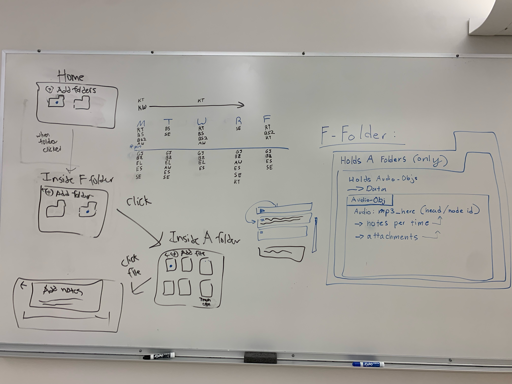

# Pitch Notes

Date: October 26, 2022
Location: CSE Basement
Participants: Billy Sudirdja, Anonymous, Grace Jin, Bennett Zhang, Ben Snowbarger, Alex Wu, Ernest Lin, Emmanuel Serrano, Ryan Truong, Kevin Truong, Sailor Eichhorn

## To find demo: https://github.com/bennett-zhang/CSE-110-text-editor.git

## To find miro: https://miro.com/app/board/uXjVPJ88Awg=/?share_link_id=881331704226

# Specs(What we doing exactly)

## Bare Bones

- Application can upload audio files
- Application has folders to place audio files, folder is just for audio files. Can call these folders TypeA_folders.
- Application has different type of folders where the TypeA_folders can go in. And only TypeA_folders can go into folders. Can call them TypeF_folders
- Application has screen where we can see all the TypeF_folders as home screen
- Application can take notes on audio files, with time stamps for specific parts in the audio file.
- Application can have multiple of these notes on for just one audio file
- Application has to create a TypeF_folder first, then TypeA_folder, then can upload new audio file in a new type of project the user wants to make or if it is the first audio file ever
- Application can delete audio files
- Application can delete TypeA_folders
- Application can delete TypeF_folders

## Rabbit Holes

- Application has search bar in home screen for TypeF_folders
- Application has a search bar in TypeF_folders to look for different TypeA_folders
- Application has search bar in TypeA_folders to look for different audio files
- Application can time stamp jump, aka when stamp time clicked can jump to that part of the audio file
- Application can move TypeA_folders to different TypeF_folders
- Application can move Audio_files to different TypeA_folders & different TypeF_folders if they like
- Application can re-name files in the app itself
- Application can export notes and audio files together
- Application can audio display
- Application has a Rich text editor
- Application is made in desktop form
- Application has user icon in home screen

## NO GO Zone

- Application can record in app
- Application has fancy UI(not enough time)
- Application can highlight part in visual audio, and create a new empty note for it
- Application can have icons on the visual audio for where we took notes
- Application can handle video files as well
- Application can sort by different categories to search by on search bar
- Application has a “waiting space” where we can put audio files, before we choice which TypeF_folder then TypeA_folder we want to put it in
- And anything else you can think of is most likely out of scope and out of time for this project, we consider what are bare bones are to be the main components of the app.

# Fat Marker Drawing

We wanted to drawn down our specs on the board so we were all on the same page about how we wanted our application to look, and how it was going to be organized as well. 

Whiteboard diagram of data structure and design structure^

NOTE: we also changed our stand-up to be MWF @10am

# Group Splitting

We split into groups to start working on different aspects of the pitch for next week. We worked within these groups for about half an hour, till the end of the meeting. Then anything that was not able to be finished for the pitch would just be done at home.

NOTE: The time on the board in the picture from the fat marker drawing were for this specific and to make sure everyone was who was working together had the same free available time to actually collaborate.

##Wire-framing

- Ryan
- Benjamin

##Event modeling/C4 diagrams

- Billy
- Alex

##Research

- Kevin
- Emmanuel

##Proof of Concept

- Sailor
- Kat
- Bennett

##Editors and User Stories/Personas

- Grace
- Ernest

# Potential Blockers?

- Proof of concepts - are they too difficult?
- Is a C4 Model going to be overly complex for such a small project?
- Will we be able to create wireframes before the first that accurately represent what we can accomplish?

## Meeting Duration: 7:00 - 9:00pm
